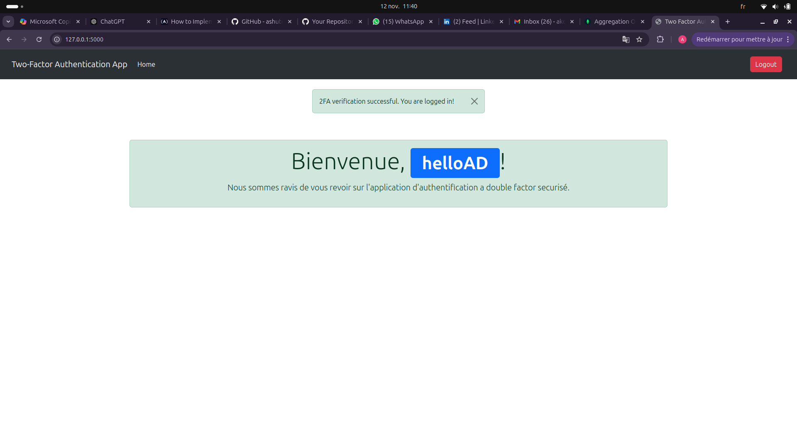
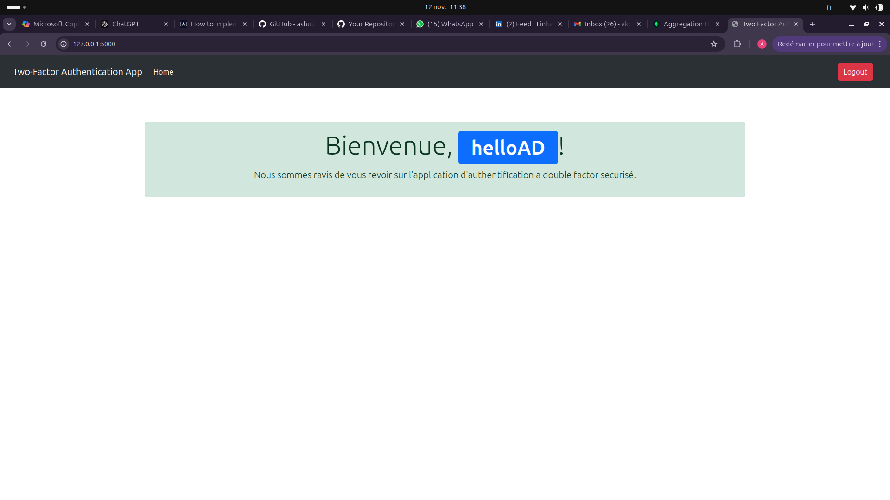
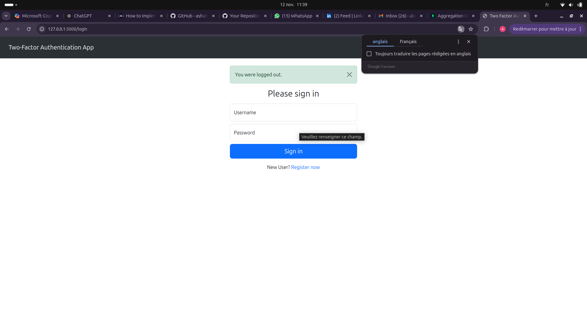
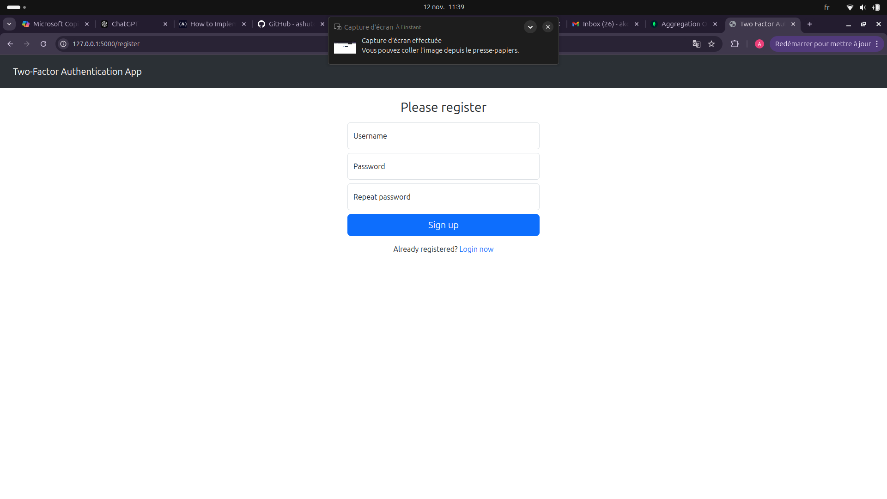

## Setup
    git clone git@github.com:AKOWAKOU/Two-Factor-Authentication.git

## Env active environment virtual
    python -m venv venv

    source venv/bin/active    

    pip install -r requirements.txt

## Upgrade the database
    flask db init

    flask db migrate

    flask db upgrade

## run the app
python manage.py run
    

## UI for apllication

### Page de Connexion

### Page de Profil Utilisateur

### Page de Profil Utilisateur

### Page de Profil Utilisateur

### Page de Profil Utilisateur

